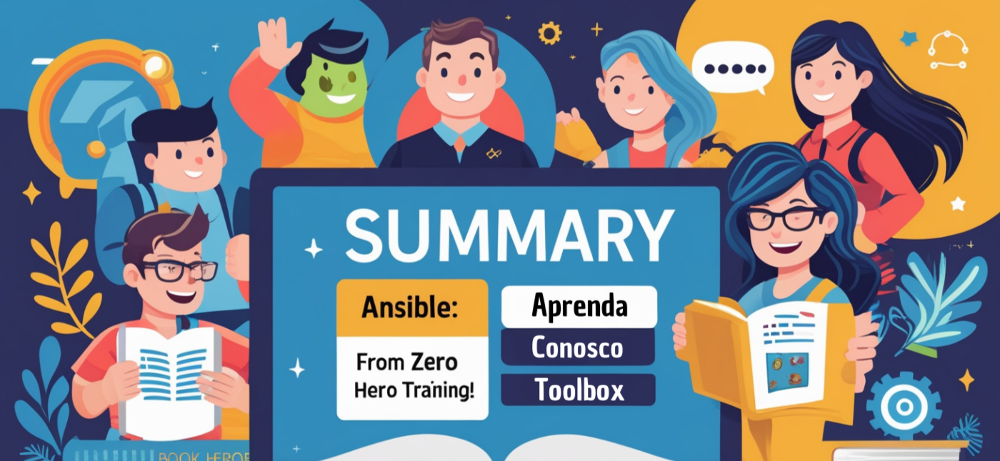

# Ansible - From Zero to Hero
Bem-vindo ao repositório oficial do curso de Ansible da Toolbox, onde transformamos o aprendizado em prática real!

# Nosso objetivo
Este treinamento intensivo, com cerca de 30 horas divididas em 5 encontros ao vivo, foi projetado para que você domine o Ansible, uma das ferramentas mais poderosas e indispensáveis para automação de TI. Nossa missão é garantir que até mesmo iniciantes absolutos possam adquirir conhecimento e praticar o uso do Ansible de forma confiante e eficaz.

A combinação de teoria e prática vai prepará-lo para os desafios do dia a dia, tornando o aprendizado envolvente e aplicável.

# Ementa do Curso
Neste curso, você aprenderá:

**- Introdução ao Ansible:** Conceitos fundamentais e visão geral da ferramenta.  
**- Instalação e Configuração:** Comece do zero com segurança e eficiência.  
**- Ansible Playbooks:** Criação de scripts poderosos para automação.  
**- Ansible Modules:** Exploração dos módulos mais utilizados.  
**- Trabalhando com Variáveis:** Personalização e dinamismo nos projetos.  
**- Handlers, Roles e Collections:** Organização e reutilização de código.  
**- Ansible Galaxy:** Aproveite o repositório oficial da comunidade.  
**- Ansible Templates:** Automatização flexível e adaptável.  
**- Ansible Vault:** Proteção de informações sensíveis.  
**- Tuning, Validation e Tests:** Refinamento e validação de automações.  
**- Conhecendo o AWX:** Gerenciamento centralizado de Ansible.  

# Dinâmica das aulas
**- Turmas Exclusivas:** Ambiente focado e interação direta com nossos especialistas.  
**- Plano Personalizado:** Adaptação ao seu nível de conhecimento e objetivos.  
**- Conteúdos Exclusivos:** Material de alta qualidade desenvolvido pela Toolbox.  

# Público-Alvo
Este curso é ideal para:  
**- Programadores:** Que desejam se destacar no mercado ao dominar práticas de DevOps.  
**- Profissionais de DevOps:** Interessados em se atualizar e aprofundar seus conhecimentos com as melhores práticas.  
**- Especialistas em Suporte, Cloud, Infra e Redes:** Que desejam migrar ou evoluir na área de DevOps, adquirindo as habilidades essenciais para impulsionar suas carreiras.

# Como Participar
Inscreva-se agora mesmo! Entre em contato com nosso time comercial pelo e-mail *contato@toolbooxdevops.cloud* ou envie uma mensagem no WhatsApp (19) 9 8199-0082.

# Entre na nossa comunidade do Discord!
[Toolbox Playground](https://discord.gg/XP8kQvpW)
